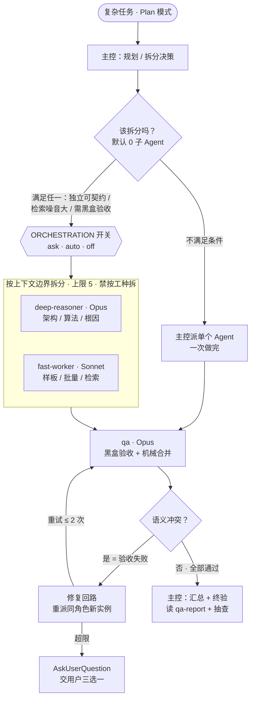

<div align="center">

# right-model-right-job

### 好钢用在刀刃上 · 为正确的任务选择正确的模型

**别把什么都丢给最大的模型。**
一套规划驱动、按需组装、验证严格、可回收的动态多 Agent 编排配置——
最强模型只做规划，便宜模型负责执行，独立 QA 黑盒把关。基于 Claude Code subagents 实现。

<p>
  
  
  
  
</p>

<p>
  <a href="#为什么需要它">为什么</a> ·
  <a href="#核心理念好钢用在刀刃上">核心理念</a> ·
  <a href="#编排流程">编排流程</a> ·
  <a href="#快速开始">快速开始</a> ·
  <a href="#决策记录">决策记录</a> ·
  <a href="#证据来源">证据来源</a>
</p>

</div>

---

## 为什么需要它

多 Agent 系统很贵，也很容易失败。同一个任务，多 Agent 要多烧 3～15 倍的 token。更麻烦的是失败率：约 79% 的多 Agent 失败并非来自模型能力不足，而是**规格没写清、Agent 之间协调出错**——这两类问题在单 Agent 里根本不存在（见 MAST 论文）。

所以这套配置的默认动作是**不拆**。只有当拆分真正划算时才拆，而且沿上下文边界拆，绝不按工种拆。它把一个朴素的常识落成了可执行的规则：**好钢用在刀刃上**——最强的模型只用来规划和把关，具体的活交给更便宜、更快的模型，最后由一个独立裁判黑盒验收。

> [!IMPORTANT]
> **三条不可逾越的红线**
> 1. **默认 0 子 Agent。** 拆分需要给出理由，不拆才是常态。
> 2. **沿上下文边界拆，禁止按工种拆。** 不做 planner / coder / reviewer 式流水线——实测中它的协调开销会超过实际干活的开销。
> 3. **QA 是独立裁判。** 只做黑盒验收，永不自写自测。这是唯一被证实能跨领域稳定生效的模式。

---

## 核心理念：好钢用在刀刃上

系统由四类角色构成，每一类只做自己最擅长的那一件事，用对应档位的模型：

| 角色 | 模型 | 只负责 | 定义文件 |
|---|---|---|---|
| **主控**（主线程） | 最强 / 主控模型 | 规划、拆分、汇总、终验——不写业务代码 | 你项目的 `CLAUDE.md` |
| **deep-reasoner** | Opus | 架构设计、算法难题、根因分析 | `.claude/agents/deep-reasoner.md` |
| **fast-worker** | Sonnet | 样板代码、批量修改、常规实现、信息检索 | `.claude/agents/fast-worker.md` |
| **qa** | Opus | 黑盒验收 + 机械合并——永不写业务代码 | `.claude/agents/qa.md` |
| **临时角色** | general-purpose + 现写 prompt | 一次性任务；同一角色复用满 2 次才沉淀成文件 | 主控动态生成 |

**仓库结构**——一共只有四个 Markdown 文件，零运行时依赖：

```
right-model-right-job/
├── CLAUDE.md                 # 编排规则，并入你项目的 CLAUDE.md
└── .claude/agents/
    ├── deep-reasoner.md      # Opus   · 重推理
    ├── fast-worker.md        # Sonnet · 机械执行
    └── qa.md                 # Opus   · 黑盒验收 + 机械合并
```

---

## 编排流程

从一个复杂任务进入，到主控汇总交付，全程如下。主控自己从不写业务代码，只做规划、拆分、汇总和终验。



几个贯穿全流程的约束：

- **并行分两轨。** 研究/检索类（只读）默认并行，宽度 ≤ 3；编码类（写入）要并行必须同时满足三条——接口契约已定死、列出禁改的公共文件、每个 Agent 独立 git worktree。任何两个并行 Agent 都不得写同一个文件。
- **通信压到最短。** 子 Agent 的详细产出一律落盘到 `.work/<任务名>/`，回传主控 ≤ 300 token（结论 + 产物路径 + 风险标记）。自由回传是主控上下文膨胀的最大来源。
- **QA 只认结果。** 输入只有三样：验收标准、测试用例、产物路径，不看执行过程（保持黑盒）。语义冲突判为验收失败，QA 不修，弹回修复回路。

---

## 快速开始

### 前置条件

| 前置 | 要求 |
|---|---|
| Claude Code | 支持 subagents 的版本（能识别 `.claude/agents/` 目录） |
| 模型访问 | 可调用 Opus 与 Sonnet（订阅或 API 均可） |
| 依赖 | 无。纯 Markdown 配置，零运行时依赖 |

### 安装

以下命令都在**你运行 `git clone` 的那个目录**里执行——克隆完不要 `cd` 进仓库，否则第 2、3 步的相对路径会失效。

```bash
# 1. 克隆本仓库
git clone https://github.com/janauto/right-model-right-job.git

# 2. 安装三个 subagent 到用户级目录（所有项目都能复用）
mkdir -p ~/.claude/agents
cp right-model-right-job/.claude/agents/*.md ~/.claude/agents/

# 3. 把编排规则并入你自己的项目（~/你的项目 换成实际路径，该目录需已存在）
#    用 >> 追加，别用 >——单个 > 会覆盖、清空你已有的 CLAUDE.md！
#    项目原本没有 CLAUDE.md 时，>> 会自动新建这个文件（但不会新建目录）。
cat right-model-right-job/CLAUDE.md >> ~/你的项目/CLAUDE.md
```

> [!TIP]
> 只想在单个项目里用、不跨项目复用？把第 2 步的 `~/.claude/agents/` 换成 `~/你的项目/.claude/agents/` 即可。

### 冒烟测试

安装完先在终端跑两条命令确认文件到位：

```bash
# A. 三个 subagent 就位——应打印三个文件路径、无报错
ls ~/.claude/agents/deep-reasoner.md ~/.claude/agents/fast-worker.md ~/.claude/agents/qa.md

# B. 编排规则已并入项目——应打印 “# 多Agent编排规则”（把路径换成你第 3 步的目标）
grep -m1 "多Agent编排规则" ~/你的项目/CLAUDE.md
```

再进 Claude Code 里做两步功能确认（这两步需要交互式会话，命令行测不了）：

1. 运行 `/agents`，列表中应能看到 `deep-reasoner`、`fast-worker`、`qa` 三个 agent。
2. 用 **Plan 模式**发起一个复杂任务。主控会按规则判断是否拆分；若决定拆分，会先弹窗列出「拟拆任务数 / 模型分配 / 预期收益」让你确认。看到这个弹窗，就说明编排规则已生效。

### 切换编排档位

`CLAUDE.md` 顶部有一行开关，改这一行即可换档：

```
ORCHESTRATION: ask
```

| 档位 | 行为 |
|---|---|
| `ask`（默认） | 每次派发 subagent 前弹窗确认，列出任务数、模型分配、预期收益 |
| `auto` | Plan 模式内自动编排，plan 审批即确认，不再单独弹窗 |
| `off` | 永不调用 subagent，全部由主控直跑 |

---

## 决策记录

每一条规则背后都有取舍，这里是完整的决策账本：

| 决策点 | 结论 | 依据 |
|---|---|---|
| 拆分策略 | 条件拆分，默认 0 子 Agent，上限 5 | 多 Agent 耗 token 3～15 倍；约 79% 多 Agent 失败源于规格与协调，单 Agent 中不存在（MAST） |
| 拆分方向 | 沿上下文边界，禁止按工种拆 | planner/coder/reviewer 拆分实测「协调 token 超过实际工作 token」（Anthropic 2026） |
| 主控角色 | 纯经理：plan / decompose / synthesize / 终验 | 用户决策 |
| 并行 | 研究类默认并行 ≤ 3；编码类需契约 + worktree | 拆分收益只在读密集 / 广度优先任务兑现（+90.2%）；编码是写密集强依赖 |
| 临时角色 | 动态 prompt 为主，≥ 2 次复用才沉淀文件 | agent description 常驻主提示，注册有持续成本 |
| 通信 | 回传 ≤ 300 token + 落盘；交接用路径 + 短摘要 | 自由回传是主控上下文膨胀的最大来源 |
| QA | 独立 Opus QA 黑盒验收 + 主控读报告抽查 | 黑盒验证子 Agent 是唯一被证实跨域稳定有效的模式 |
| 合并 | QA 机械合并，语义冲突弹回不修 | 保证每行业务代码都被独立验收；QA 不能自写自测 |
| 修复回路 | 重派同角色新实例 ×2，超限弹窗问用户 | 子 Agent 上下文返回即销毁，「退回原作者」实为重派 |
| Codex 双跑 | 仅不可逆决策 | 跨家族验证 +7 个百分点但成本 ×2；同家族误差相关 r=0.67，跨家族 r=0.53 |
| 计费 | 订阅为主，API 溢出 | 用户决策 |
| 生命周期 | 单会话，无持久化状态层 | 用户决策；若未来出现跨天项目，再补任务账本 |

---

## 升级路径（跑起来之后观察）

- **语义冲突弹回频繁** → 病根在 plan 期接口契约不够死，先修契约模板；仍频繁再单设 Sonnet 集成 Agent。
- **编码并行合并成本持续高于省下的时间** → 编码退回全串行。
- **出现跨会话长项目** → 在 `.work/` 加 `PLAN.md` 任务账本。

---

## 证据来源

- [Anthropic: Multi-agent research system](https://www.anthropic.com/engineering/multi-agent-research-system)
- [Anthropic: Building multi-agent systems — when and how](https://claude.com/blog/building-multi-agent-systems-when-and-how-to-use-them)
- [Cognition: Don't Build Multi-Agents](https://cognition.ai/blog/dont-build-multi-agents)
- [MAST: Why Do Multi-Agent LLM Systems Fail? (arXiv:2503.13657)](https://arxiv.org/abs/2503.13657)
- [Claude Code subagents 文档](https://code.claude.com/docs/en/sub-agents)
- [LLMs Cannot Self-Correct Reasoning Yet (arXiv:2310.01798)](https://arxiv.org/abs/2310.01798)
- [Nine Judges, Two Effective Votes (arXiv:2605.29800)](https://arxiv.org/html/2605.29800)

---

<div align="center">
<sub>规划驱动 · 按需组装 · 验证严格 · 可回收 —— 让每个 token 花在刀口上。</sub>
</div>
